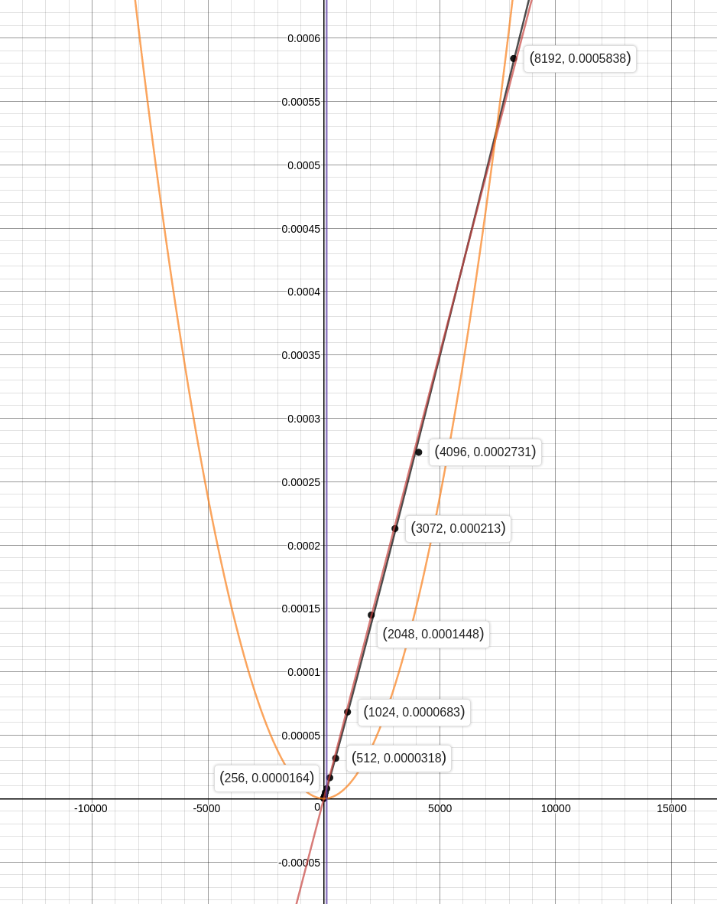
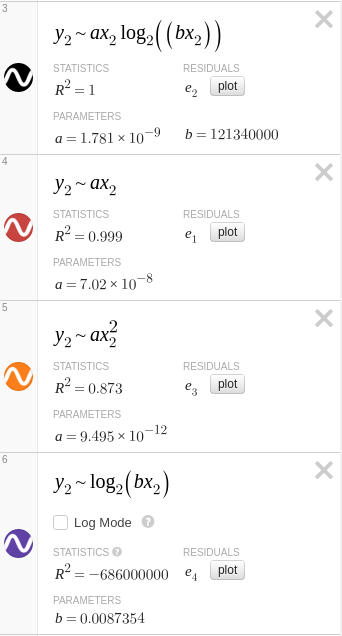
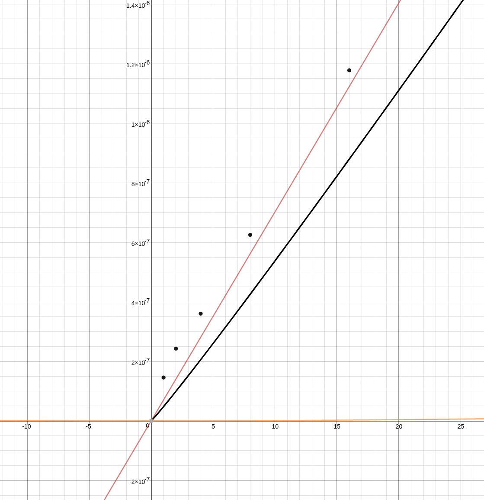
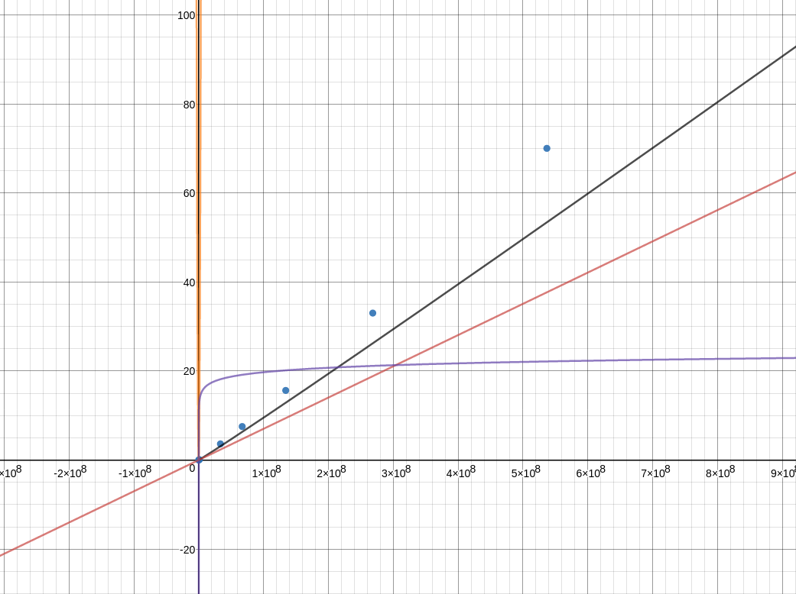

************
3G Chipmunks
APCS2 pd03
02/14/2017
************

#MergeSort:
1) The array is split into two smaller arrays until each array is only one element long. 2) The sorted arrays are merged until there is one fully sorted array.
—> They are merged by comparing the “top” value of each array and placing the smaller element into the front of the retArray (the array that will be returned) & then comparing the next values of the respective arrays… until all slots in retArray have been filled.
—> We know all of the elements will have been used by then because the length of the retArray is the sum of the lengths of the merging arrays.

#How To Run:
First, clone the repository using `git clone git@github.com:TerryMinal/3GChipmunks.git`. Then, you can run the program for yourself to simply `javac MergeSortTester.java && java MergeSort`.
This program contains really large test cases (arrays with 500 million elements!), and may require extra memory. In order to run the entire thing, you will need more than 8GB of memory, although the smaller test cases will generate nonetheless. If you have lots of system memory, consider allocating 75% of it. For instance, if you have 16GB, consider running `javac MergeSortTester.java && java -Xmx12G MergeSort`, letting java know the most memory it can use is 12GB, and not the default limit.

#Time Trials:
This data was collected by running 10,000 runs and averaging them for each number in the first table, and doing 10 runs and averaging them in the second table. These calculations were done on a 3770k running Ubuntu 16.04 and OpenJDK 1.8.0_91  

 This was then graphed, using [desmos](https://www.desmos.com/calculator), and the built in regression algorithims were used to approximate functions that fit the given data points. The black represents the O(nlogn) approximation, the red O(n), the orange O(n^2), and the purple O(logn). As you can see, the two lines that best fit are the red and black, meaning even for arrays as small as 8192 elements the runtime becomes near linear.
 
 [Note: In all these graphs the x axis represents the number of elements, and the y axis represents the average evaluation time in seconds]

This is the regression information for the smaller graph:

This was the table used for these graphs:

| Length | Time (s)              |
|--------|-----------------------|
| 1      | 1.4551380000000337E-7 |
| 2      | 2.4270070000002437E-7 |
| 4      | 3.602781000000001E-7  |
| 8      | 6.248870000000308E-7  |
| 16     | 1.1774998000000257E-6 |
| 32     | 2.2847292000000016E-6 |
| 64     | 4.7921113999999035E-6 |
| 128    | 7.881168499999973E-6  |
| 256    | 1.6433291299999937E-5 |
| 512    | 3.1763626199999976E-5 |
| 1024   | 6.828058740000016E-5  |
| 2048   | 1.4479020969999972E-4 |
| 3072   | 2.130106798999999E-4  |
| 4096   | 2.7314396470000076E-4 |
| 8192   | 5.838023573999982E-4  |

Based off this information, it would be easy to assume that the run time could possibly be O(n). However, it can be theoretically approximated to O(logn) by considering only the smaller values of the table. We noticed that the loglinear curve more closely reflected how the values changed over time, even if it was shifted over a bit. While hard to notice with larger numbers, with smaller numbers it became apparent the runtime was not linear, and therefore had to be O(nlogn), backing up what we had theoretically hypothesized as a group.

As a thought experiment, one of us decided to mess around with even larger numbers to calculate the runtimes. In order to successfully run this, more memory needed to be allocated to the JVM, using the command `java -Xmx12G` to allocate 12GB of system memory to the process (this was a tiny bit overkill, but our biggest array did contain 500million elements and the sorting method wasn't the most space efficient. Don't try this without a lot of memory, or running chrome and/or Windows). Instead of running the tests 10K times, since they would take so long to compute they were only run 10 times. This was the result:

| Length    | Time (s)              |
|-----------|-----------------------|
| 32768     | 0.0024510802999999997 |
| 1048576   | 0.0939761007          |
| 33554432  | 3.638622524800001     |
| 67108864  | 7.532464125399999     |
| 134217728 | 15.639892073199999    |
| 268435456 | 33.0249188564         |
| 536870912 | 70.03368628129999     |

Plotting the points while keeping the best fit equations of the different types as described for the original dataset produces this, which shows the black (O(nlogn)) to be the closest approximation, even for bigger numbers and shows that it is the curve that best fits the change from one point to the next.
